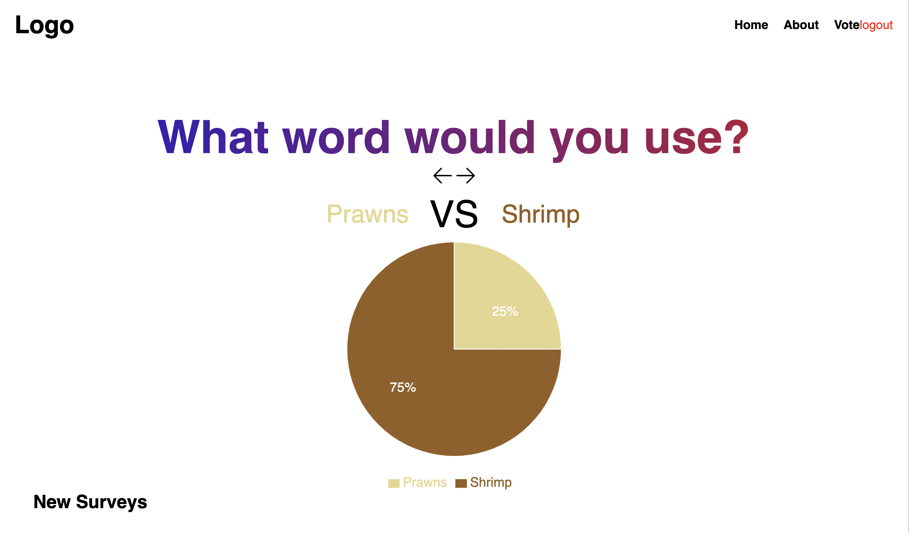

# Eytanzon- Word comparison app

Hi there everyone. This app allows us to to compare between two synonym words, understand where in the world the words are used, and what ages use them. 

This app is built with React typescript and stores the data in MongoDb. 
This project is still in production and updates will be made in the near future.

